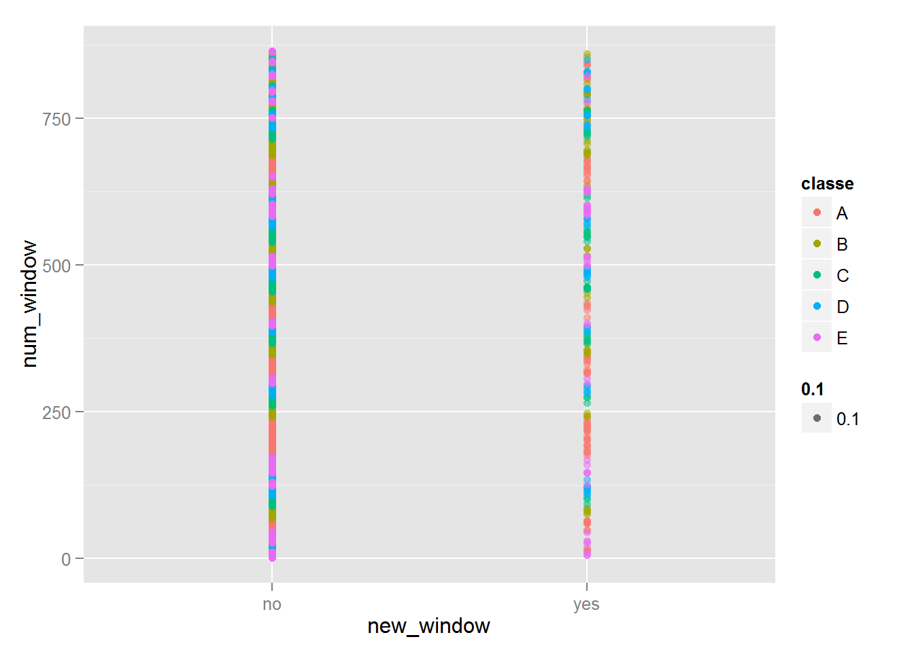
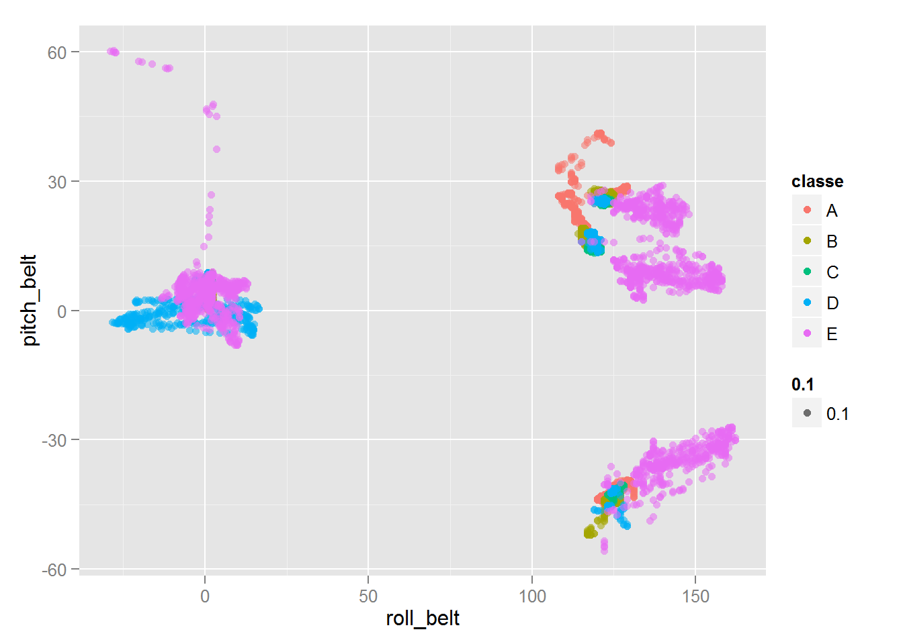
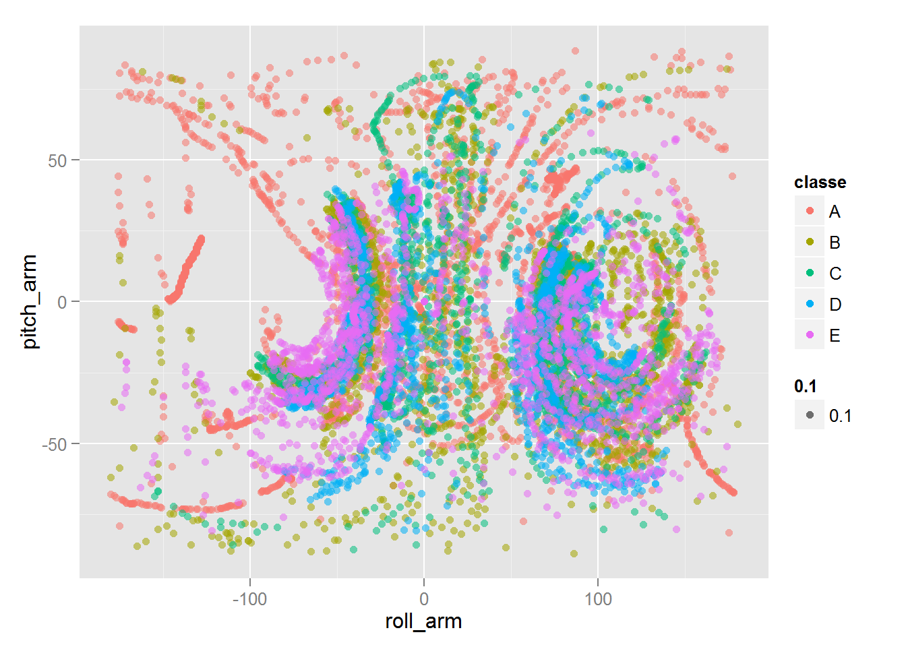
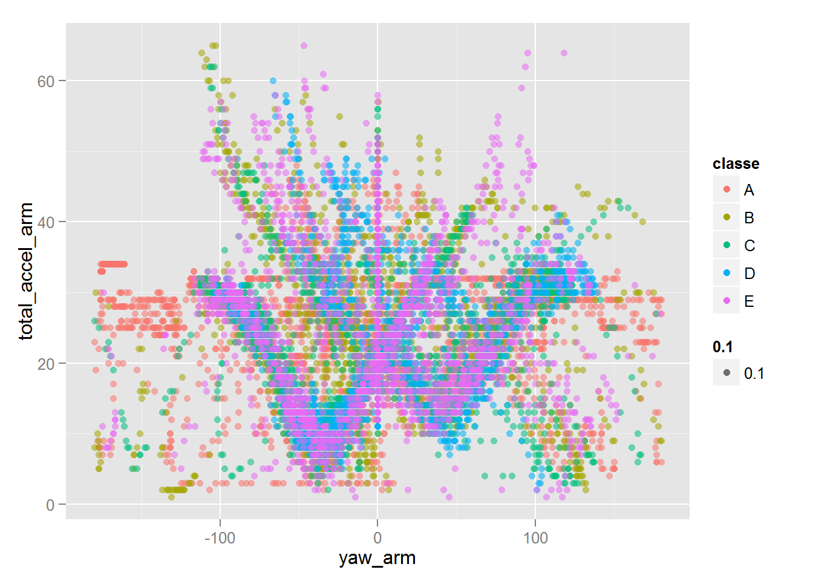

Practical Machine Learning Write_Up Assignment
========================================================

## Executive Summary
Using devices such as Jawbone Up and Fitbit it is now possible to collect a large amount of data
about personal activity relatively inexpensively. One thing that people regularly do is quantify how much of a
particular activity they do, but they rarely quantify how well they do it. 
Within this assignment 18 variables are choosen to predict which exercise is done, and train the data using random forest method.
The expected error rate is less than 0.3% in test sample. That is sufficient enough to do the prediction.

## Analysis
At first it will be checked, if the data files exists otherwise it is downloaded. Finally the data is read in:

```r
setwd('C:\\Meine Module\\coursera\\Hausaufgabe\\plm')
if (!file.exists("pml-training.csv")) {
  download.file("https://d396qusza40orc.cloudfront.net/predmachlearn/pml-training.csv", 
              destfile="pml-training.csv", method="curl")
}

raw_training <- read.csv("pml-training.csv")

if (!file.exists("pml-testing.csv")) {
  download.file("https://d396qusza40orc.cloudfront.net/predmachlearn/pml-testing.csv", 
              destfile="pml-testing.csv", method="curl")
}

testing  <- read.csv("pml-testing.csv")
```

The raw training data is parted into training and the cross-validation data:

```r
library(caret)
```

```
## Loading required package: lattice
## Loading required package: ggplot2
```

```r
set.seed(1)
inTrain <- createDataPartition(y=raw_training$classe,p=0.6, list=F)
training <- raw_training[inTrain, ]
cv       <- raw_training[-inTrain, ]
```

To avoid the summary being too exhausting only some of the variables are plotted. 
Four of them are qploted in the following:

```r
qplot(new_window, num_window, col=classe, data=training, alpha=0.1)
```

 

```r
qplot(roll_belt, pitch_belt, col=classe, data=training, alpha=0.1)
```

 

```r
qplot(roll_arm, pitch_arm, col=classe, data=training, alpha=0.1)
```

 

```r
qplot(yaw_arm, total_accel_arm, col=classe, data=training, alpha=0.1)
```

 

After this plotting analysis, we adopt the following variables as explanatory variables:

```r
input_vars_list <- c("new_window", "num_window", "roll_belt", "pitch_belt", "yaw_belt", 
  "total_accel_belt", "roll_arm", "pitch_arm", "yaw_arm", "total_accel_arm", 
	"roll_dumbbell", "pitch_dumbbell", "yaw_dumbbell", "total_accel_dumbbell",
	"roll_forearm", "pitch_forearm", "yaw_forearm", 
	"total_accel_forearm");
```

Using this explanatory variables, we create models using the random forest method:

```r
exp_input <- function(x){
  res = x[1]
  for (i in 2:length(x)){
    res <- paste(res, " + ", x[i], sep = "")
  }
  res
}
input_vars <- exp_input(input_vars_list)
set.seed(2)
modFit <- train(eval(parse(text = paste("classe ~", input_vars, sep = ""))), data = training, method = "rf")
```

```
## Loading required package: randomForest
## randomForest 4.6-7
## Type rfNews() to see new features/changes/bug fixes.
```

## Results

Checking error rate in the training and the cross-validation data. 
The error rate is less than 0.3% in the cross-validation data. 

```r
missClass <- function(values, prediction){
  sum(prediction != values)/length(values)
}
missClass(training$classe, predict(modFit, training))
```

```
## [1] 0
```

```r
missClass(cv$classe, predict(modFit, cv))
```

```
## [1] 0.002549
```

The resulting model is used to make the predictions and write the results in several text files.

```r
answers <- predict(modFit, testing)
pml_write_files = function(x){
  n = length(x)
  for(i in 1:n){
    filename = paste("problem_id_", i, ".txt", sep = "")
    write.table(x[i], file = filename, quote = FALSE, row.names = FALSE, col.names = FALSE)
  }
}
pml_write_files(answers)
```
